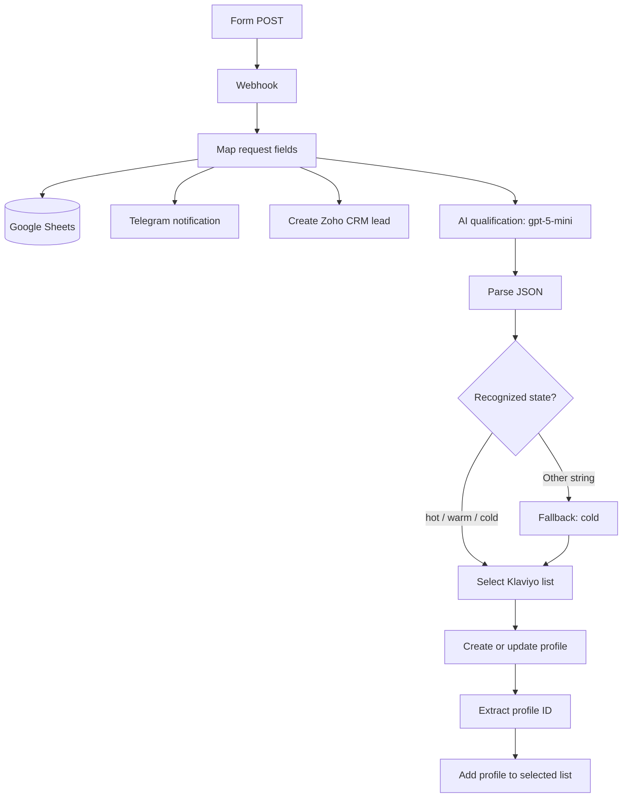

# LeadFlow AI

**Form-to-CRM lead intake and AI-assisted marketing segmentation, built with n8n and `gpt-5-mini`.**

LeadFlow connects a landing-page form with Google Sheets, Telegram, Zoho CRM and Klaviyo. It maps a request into shared fields, creates a CRM lead, notifies the team and uses an AI classification to select a Hot, Warm or Cold marketing list.

**Educational demonstration prototype, not a real client deployment.** The portfolio scenario assumes **20–30 enquiries per day and a three-person team: two sales managers and one marketer**. These are scenario assumptions, not measured throughput or customer results.

## The business problem

Manual copying separates lead capture from sales follow-up and marketing segmentation. A shared intake workflow can pass the same request to the team's tools without requiring repeated data entry.

This prototype demonstrates the routing and integration pattern. It does not yet provide production-grade validation, deduplication or guaranteed delivery.

## How it works

The four downstream branches originate from the same field-mapping node. They are independent routes, not a transactional or atomic operation across services.

## Implementation highlights

- **One source workflow:** 22 nodes, including one sticky note.
- **Shared field mapping:** name, contact, email, business description and automation goals.
- **CRM handoff:** creates a lead in Zoho CRM and maps contact details.
- **Team notification:** formats the submitted fields for Telegram.
- **AI classification:** the original Ukrainian prompt asks `gpt-5-mini` for a JSON object containing `state`.
- **Marketing routing:** selects a Klaviyo list for `hot`, `warm` or `cold`; other string states are routed through the Cold fallback.

The workflow uses a basic LLM chain and `JSON.parse`, not a schema-enforced output parser. Invalid JSON fails before the state fallback. The source maps contact fields without actually normalizing or validating email/phone values. See [known limitations](docs/LIMITATIONS.md).

## Demonstration evidence

The [portfolio case](https://app.notion.com/p/39d7a4cb52cc813fba3cd37f9ea6b019) describes a tested path from form intake to CRM, team notification and marketing segmentation. Original execution logs and timing samples have not been supplied for this package.

No conversion uplift, response-time improvement, throughput benchmark or production reliability result is claimed. The package includes source-preserving offline regression checks; these are separate from live integration checks.

## Setup and validation

Start with the [setup guide](docs/SETUP.md) and [validation checklist](docs/VALIDATION.md). Use synthetic data and separate test accounts. Do not activate a public webhook until its access controls and failure paths have been reviewed.

- [Sanitized n8n export](workflows/lead-intake.json) — inactive, with resource placeholders and no credential bindings.
- [Synthetic form payload](examples/form-submission.json) and [model response examples](examples/model-responses.json).
- Run offline checks with Node.js 22 or newer: `npm test`. No dependencies or external API calls are required.

**Validation:** 30 offline checks passed. They cover graph/configuration integrity, field mapping, JSON parsing, list routing and documented failure modes. They do not certify live integrations or model accuracy.

The original export references SYNTRA Labs in its prompt, Telegram notification and fixed Zoho Company field. These template labels are not evidence of a client engagement. Their adaptation should be treated as a separately reviewed configuration/prompt change.

## Walkthrough and contact

- [Loom demonstration — Ukrainian narration](https://www.loom.com/share/9d993da280ea4eee9ed51f20a067ed4e)
- [AI Automation portfolio](https://vladyslav-ai-automation.notion.site/AI-Automation-Portfolio-3917a4cb52cc81408f7cebb09a5d14ce)
- [Vladyslav Moskalkov on LinkedIn](https://www.linkedin.com/in/vladyslav-moskalkov/)

## Security and reuse

The public copy has six credential bindings and private resource/webhook identifiers removed, with activation disabled and execution data cleared. Business logic, connection topology, Code-node JavaScript and the original prompt are preserved. The original file is not included. See [security notes](SECURITY.md).

No open-source license has been selected. Public visibility does not grant unrestricted reuse rights.
